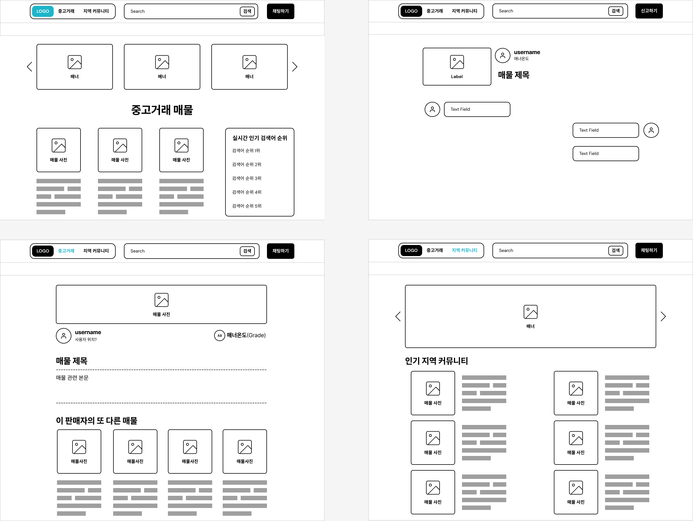

# 중고의 집(Semi Project1)
> - 지역 커뮤니티에서 서로 소통하며 중고 매물을 업로드하고 의견을 주고받는 커뮤니티
> - 사용자 맞춤 세부 서비스: DM 보내기, 팔로우, 좋아요, 댓글/대댓글, 매너온도, 거래장소 지정, 인기 검색어 등

## 🔨 프로젝트 기간
- 2022.10.31(MON) ~ 2022.11.07(MON), ** 총 8일 **

    <h3>📚 사용한 기술 STACKS</h3>
    
    
    
    

    
    

### 📌 서비스 주요 기능

---

- 회원관리
  - 회원가입
  - 로그인
  - 로그아웃
  - 회원 프로필
  - 팔로우 / 취소
  - 블랙리스트
- 지역 커뮤니티
  - 이미지 업로드
  - 글 수정 / 삭제
  - 좋아요 / 취소
  - 댓글 작성 / 수정 / 삭제 / 신고
  - 대댓글 작성 / 수정 / 삭제 / 신고
- 상품
  - 이미지 업로드
  - 글 수정 / 삭제
  - 좋아요 / 취소
  - 판매 위치 또는 택배 거래 유무
  - 판매자가 파는 다른 상품 소개
  - 매너온도
- 채팅
- 검색
  - 인기 검색어 순위
- 문의하기
  - 문의 제목
  - 문의 글
  - 사진 업로드 (선택)
  - 자주 묻는 질문 (후순위)

### 📌 화면 설계

---

### 📌DB 모델링

---

